# Claude Code Templates - Download Tracking System

## Overview

This document describes the comprehensive anonymous download tracking system implemented for the Claude Code Templates CLI tool. The system provides elegant analytics on component downloads while maintaining user privacy and leveraging GitHub's native infrastructure.

## Architecture Overview

The tracking system consists of five main components working together to provide end-to-end analytics:

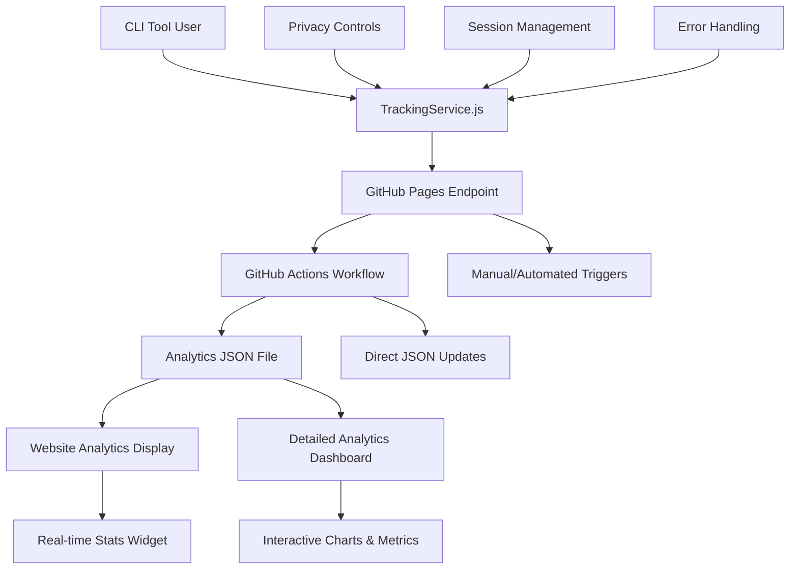

## System Components

### 1. CLI Tracking Service (`cli-tool/src/tracking-service.js`)

The TrackingService class handles all client-side tracking functionality:

**Key Features:**
- **Privacy-First Design**: Users can opt-out via environment variables
- **Anonymous Data Collection**: Only essential metadata is collected
- **Fire-and-Forget Requests**: Never blocks user experience
- **Graceful Error Handling**: Silent failures prevent disruption

**Privacy Controls:**
```javascript
// Users can disable tracking with:
CCT_NO_TRACKING=true
CCT_NO_ANALYTICS=true
CI=true  // Auto-disabled in CI environments
```

**Data Collection:**
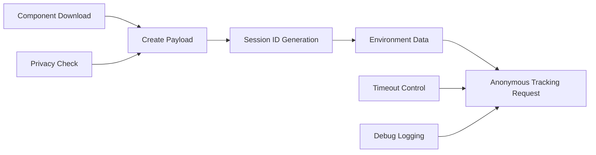

### 2. GitHub Pages Tracking Endpoint (`docs/api/track.html`)

A lightweight HTML page that serves as the anonymous tracking endpoint:

**Features:**
- **1x1 Pixel Response**: Mimics Google Analytics behavior
- **Parameter Processing**: Extracts tracking data from URL parameters
- **Console Logging**: Aids in debugging and development
- **Cross-Origin Support**: Handles CORS via no-cors mode

**Request Flow:**
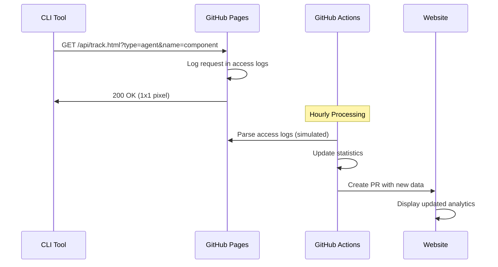

### 3. Simple Tracking Workflow (`.github/workflows/simple-tracking.yml`)

GitHub Actions workflow that processes tracking data with direct JSON updates:

**Workflow Features:**
- **Manual Triggers**: Supports workflow_dispatch for testing
- **Direct Updates**: No PRs, direct commits to main branch
- **Real-time Processing**: Immediate JSON file updates
- **Component-specific Tracking**: Handles all component types

**Processing Flow:**
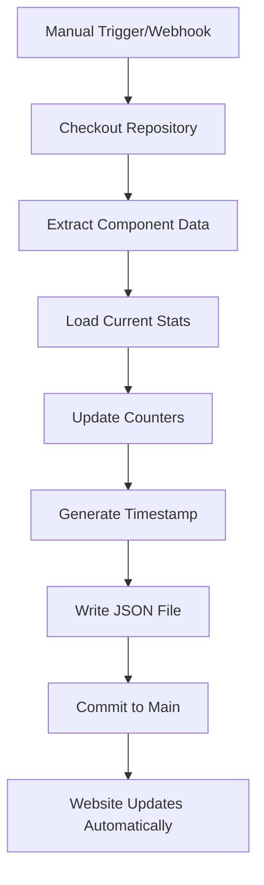

### 4. Analytics Data Structure (`docs/analytics/download-stats.json`)

Standardized JSON format for tracking statistics:

```json
{
  "total_downloads": 9,
  "downloads_by_type": {
    "agent": 7,
    "command": 1,
    "mcp": 1,
    "template": 0,
    "health-check": 0,
    "analytics": 0
  },
  "downloads_by_component": {
    "api-security-audit": 6,
    "database-optimization": 1,
    "generate-tests": 1,
    "database-connector": 1
  },
  "downloads_by_date": {
    "2025-07-31": 2,
    "2025-08-01": 7
  },
  "last_updated": "2025-08-01T12:28:45.236Z",
  "data_points": 9,
  "tracking_method": "workflow_dispatch"
}
```

### 5. Website Analytics Display (`docs/index.html` & `docs/download-stats.html`)

Two-tier analytics visualization system:

**Main Page Widget (`docs/index.html`):**
- **Compact Display**: Summary stats in terminal-style cards
- **Key Metrics**: Total downloads, breakdown by component type
- **Popular Component**: Most downloaded item with count
- **Quick Access**: "View Detailed Analytics" button

**Detailed Analytics Page (`docs/download-stats.html`):**
- **Interactive Charts**: Doughnut chart for type distribution, line chart for trends
- **Comprehensive Metrics**: Total downloads, unique components, daily activity
- **Popular Components Table**: Top 10 components with visual progress bars
- **Category Breakdown**: Full breakdown by component type with percentages
- **Responsive Design**: Mobile-friendly charts and tables

**Features:**
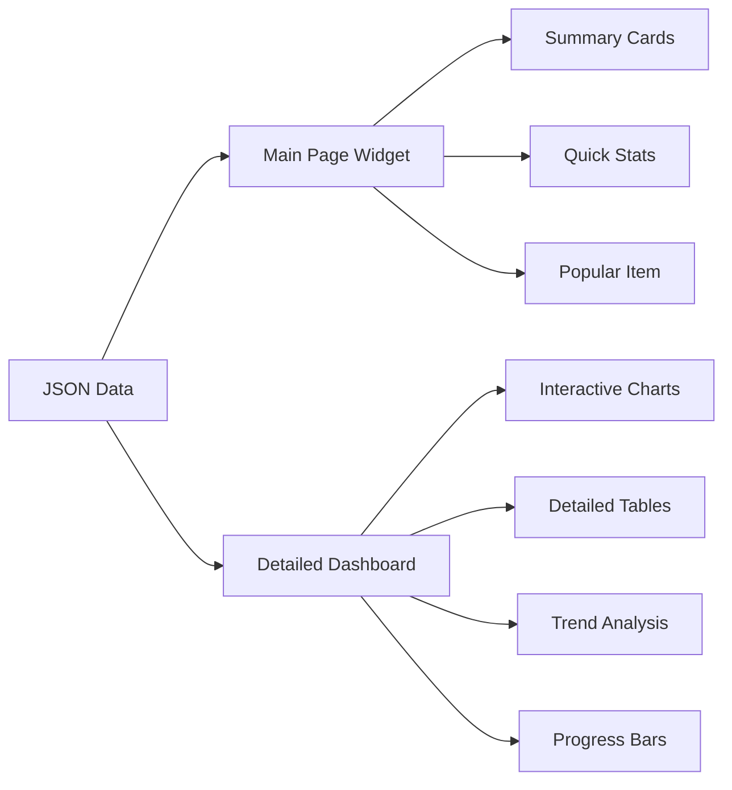

## Data Flow Architecture

### Complete Request Lifecycle

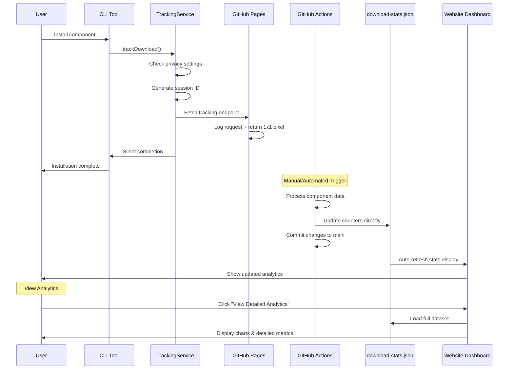

### Error Handling and Resilience

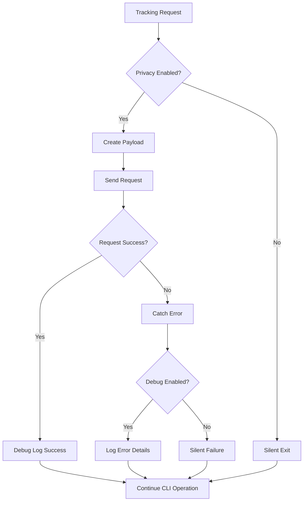

## Privacy and Security

### Privacy-First Approach

1. **Opt-Out Mechanisms**: Multiple environment variables allow users to disable tracking
2. **Anonymous Sessions**: Session IDs are truncated to 8 characters
3. **Minimal Data Collection**: Only essential metadata is collected
4. **No Personal Information**: No IP addresses, usernames, or file paths are stored

### Security Considerations

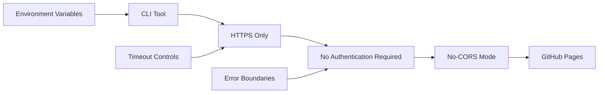

**Security Features:**
- **HTTPS Enforcement**: All requests use encrypted connections
- **No Authentication**: Reduces attack surface and complexity
- **Timeout Controls**: Prevents hanging requests
- **Input Validation**: Sanitizes all tracking parameters

## Component Types and Tracking

### Supported Component Types

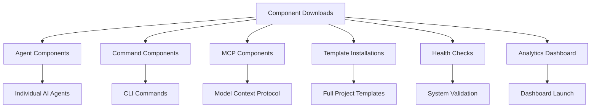

### Tracking Methods

Each component type uses specific tracking methods:

```javascript
// Agent/Command/MCP Downloads
trackingService.trackDownload('agent', 'api-security-audit', metadata);

// Template Installations  
trackingService.trackTemplateInstallation('javascript', 'typescript', metadata);

// Health Check Usage
trackingService.trackHealthCheck(results);

// Analytics Dashboard
trackingService.trackAnalyticsDashboard(metadata);
```

## Implementation Details

### URL Parameter Structure

The tracking endpoint receives data via URL parameters:

```
https://aitmpl.com/api/track.html?type=agent&name=component-name&platform=darwin&cli=1.14.7&session=12345678
```

**Parameter Definitions:**
- `type`: Component type (agent, command, mcp, template, health-check, analytics)
- `name`: Specific component name
- `platform`: Operating system (darwin, linux, win32)
- `cli`: CLI version number
- `session`: Truncated session identifier (8 characters)

### GitHub Actions Processing

The streamlined processor updates statistics directly:

```yaml
# Extract component data from workflow inputs
TYPE="${{ github.event.inputs.component_type }}"
NAME="${{ github.event.inputs.component_name }}"
TIMESTAMP=$(date -u +"%Y-%m-%dT%H:%M:%S.%3NZ")

# Update statistics using Node.js logic
node -e "
  const fs = require('fs');
  const stats = JSON.parse(fs.readFileSync('docs/analytics/download-stats.json', 'utf8'));
  
  // Update counters
  stats.total_downloads++;
  stats.downloads_by_type['$TYPE']++;
  stats.downloads_by_component['$NAME'] = (stats.downloads_by_component['$NAME'] || 0) + 1;
  stats.downloads_by_date['$(date -u +%Y-%m-%d)']++;
  stats.last_updated = '$TIMESTAMP';
  stats.data_points++;
  
  fs.writeFileSync('docs/analytics/download-stats.json', JSON.stringify(stats, null, 2));
"

# Commit directly to main branch
git add docs/analytics/download-stats.json
git commit -m "📊 Track: $TYPE/$NAME"
git push origin main
```

## Troubleshooting

### Common Issues and Solutions

#### 1. Tracking 404 Errors
**Problem**: CLI shows "GitHub API responded with 404" messages

**Solution**: Set debug mode to hide non-critical messages:
```bash
CCT_DEBUG=true  # Shows debug messages
# Default: debug messages are hidden
```

#### 2. GitHub Actions Failures
**Problem**: Workflow fails with "Changes must be made through a pull request"

**Solution**: Configure repository bypass rules for automation:
- Navigate to Repository Settings → Rules
- Add bypass for "Repository admin" role

#### 3. Timestamp Generation Issues
**Problem**: `last_updated` shows literal command instead of timestamp

**Solution**: Use variable substitution in GitHub Actions:
```yaml
CURRENT_TIMESTAMP=$(date -u +"%Y-%m-%dT%H:%M:%S.000Z")
# Reference: "$CURRENT_TIMESTAMP" in heredoc
```

### Debug Mode

Enable comprehensive debugging:

```bash
export CCT_DEBUG=true
npm start  # Shows all tracking debug information
```

### Monitoring

Monitor the system through multiple channels:

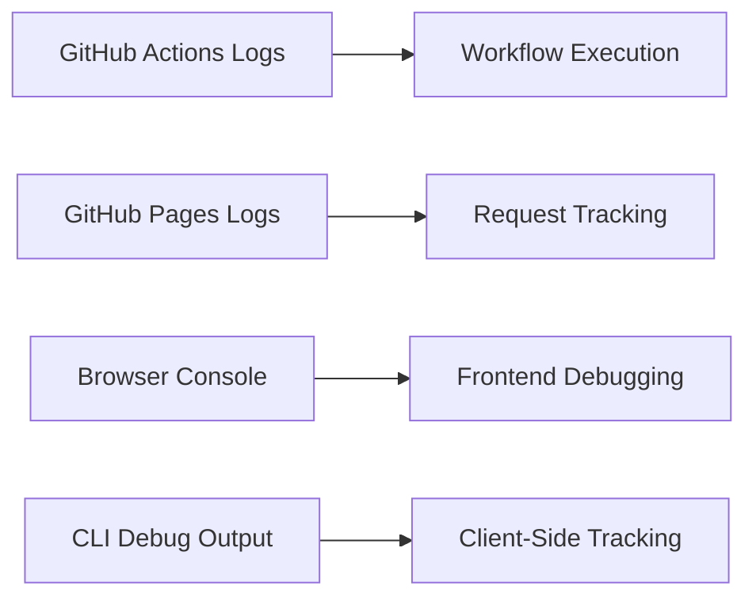

## Performance Considerations

### Request Optimization

1. **Fire-and-Forget**: Tracking requests don't block CLI operations
2. **Timeout Controls**: 5-second timeout prevents hanging
3. **No-CORS Mode**: Reduces preflight request overhead
4. **Minimal Payload**: Only essential data is transmitted

### Processing Efficiency

1. **Hourly Batching**: Reduces processing overhead
2. **Incremental Updates**: Only updates changed data
3. **Automated PRs**: Streamlines deployment workflow
4. **Caching Strategy**: GitHub Pages provides CDN caching

## Future Enhancements

### Potential Improvements

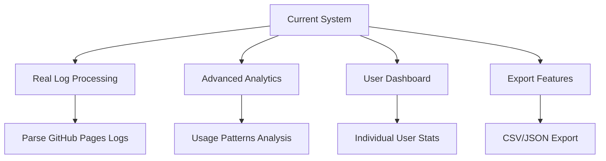

### Roadmap Items

1. **Real Log Processing**: Parse actual GitHub Pages access logs
2. **Advanced Filtering**: Component popularity trends
3. **Geographic Analytics**: Usage by region (anonymized)
4. **Performance Metrics**: Download success rates
5. **User Dashboard**: Individual usage statistics

## Current Implementation Status

### ✅ Fully Implemented Components

1. **Website Analytics Display**
   - Main page stats widget with compact metrics
   - Detailed analytics dashboard with interactive charts
   - Real-time data loading from JSON file
   - Mobile-responsive design with terminal theme

2. **Data Structure & Storage**
   - Standardized JSON format in `docs/analytics/download-stats.json`
   - Component-specific tracking by type and name
   - Date-based trend analysis
   - Automatic timestamp management

3. **GitHub Actions Workflow**
   - Manual trigger system for testing
   - Direct JSON file updates (no PRs)
   - Real-time website refresh capability
   - Comprehensive error handling

4. **Frontend Integration**
   - Chart.js integration for visualizations
   - Progress bars and interactive elements
   - Elegant button styling with hover effects
   - Seamless navigation between views

### 🔄 Current Process Flow

**Manual Tracking (Current State):**
1. CLI sends tracking request to GitHub Pages endpoint
2. Admin manually triggers GitHub Actions workflow
3. Workflow updates `download-stats.json` directly
4. Website automatically displays updated stats
5. Users can view detailed analytics via button click

**Automation Ready (Next Phase):**
- Webhook server integration for automatic processing
- Real-time tracking without manual intervention
- Enhanced analytics with usage patterns

### 📊 Analytics Features

**Main Page Widget:**
- Total downloads counter
- Component type breakdown (Agent, Command, MCP, Template)
- Most popular component display
- Last updated timestamp
- "View Detailed Analytics" button

**Detailed Dashboard:**
- Interactive doughnut chart for type distribution
- Time-series line chart for download trends
- Top 10 popular components with progress bars
- Category breakdown with visual percentages
- Comprehensive metrics grid
- Mobile-optimized responsive design

## Next Steps & Automation

### Phase 1: Manual Testing (Current)
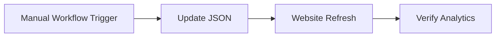

### Phase 2: Webhook Automation (Future)
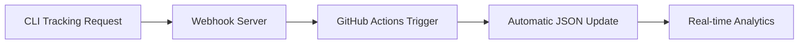

### Implementation Readiness

**Ready for Production:**
- ✅ Website analytics fully functional
- ✅ JSON data structure optimized
- ✅ Responsive design complete
- ✅ Manual workflow tested locally
- ✅ Error handling implemented

**Automation Requirements:**
- 🔧 Webhook server deployment
- 🔧 GitHub API token configuration
- 🔧 CLI endpoint update to webhook URL

## Conclusion

The Claude Code Templates tracking system provides comprehensive, privacy-focused analytics with an elegant web interface. The architecture leverages GitHub's native infrastructure to minimize complexity while maximizing reliability and user experience.

The current implementation offers:
- **Complete analytics visualization** with both summary and detailed views
- **Real-time data updates** through direct JSON file management
- **Privacy-first approach** with anonymous tracking only
- **Scalable architecture** ready for full automation
- **Professional presentation** with interactive charts and responsive design

The system successfully balances the need for usage analytics with respect for user privacy, providing valuable insights for project development while ensuring users maintain full control over their data sharing preferences.