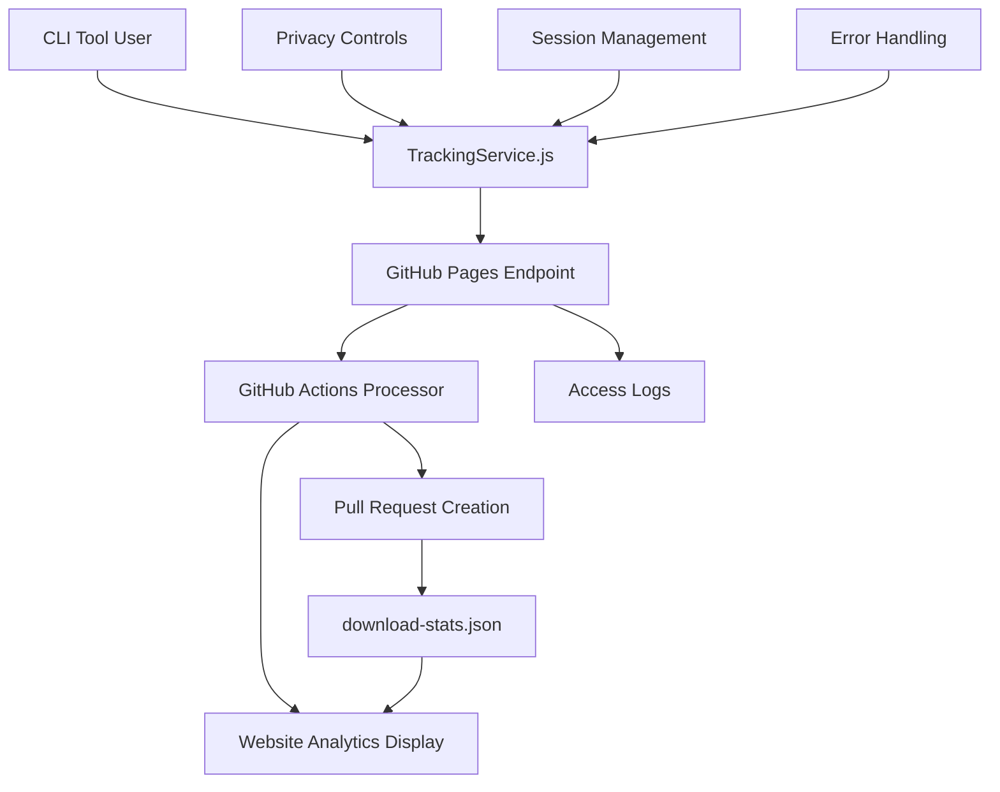
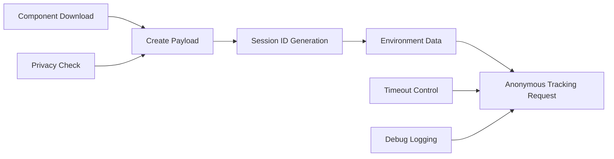
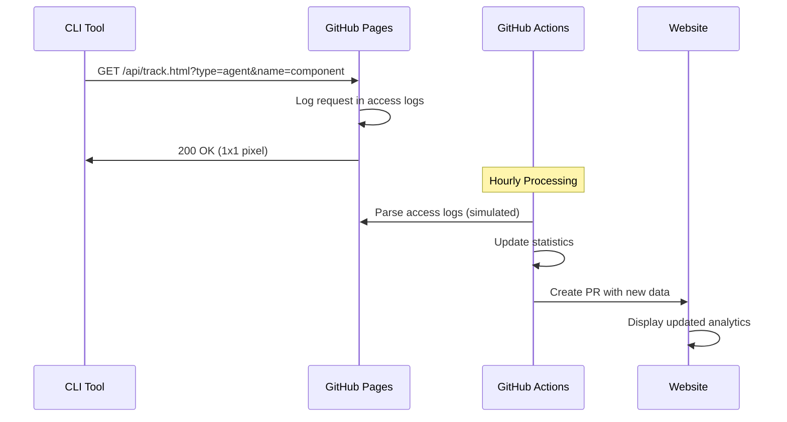
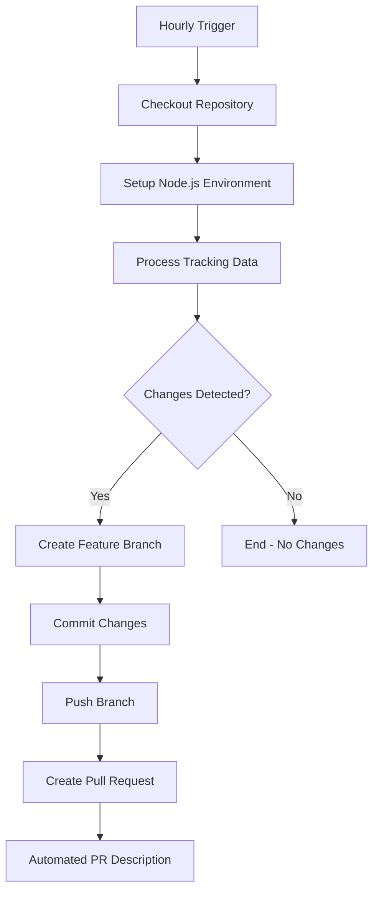
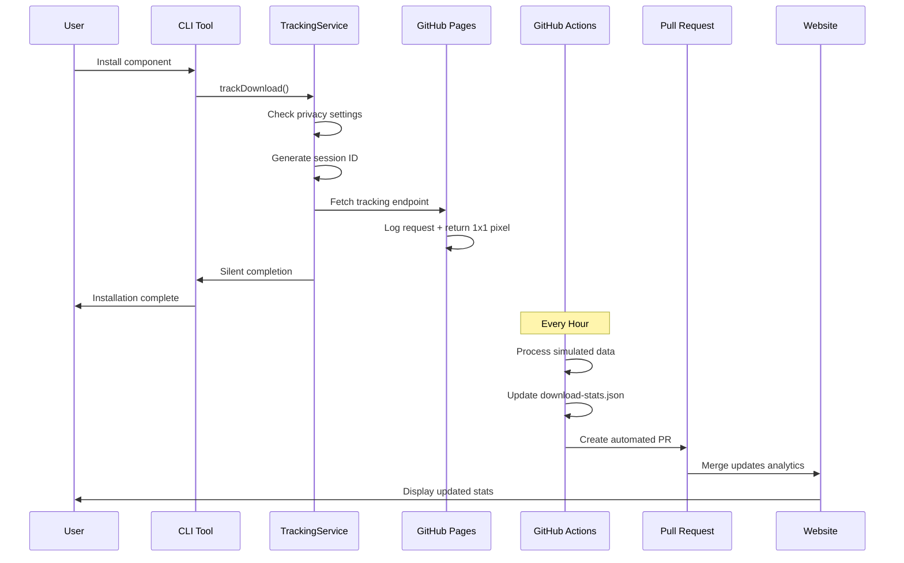
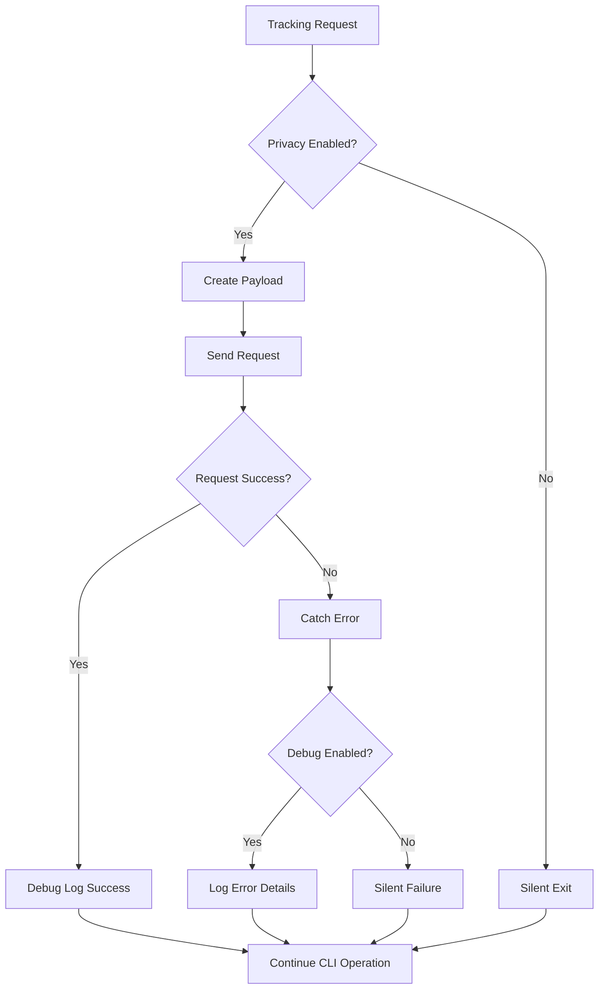
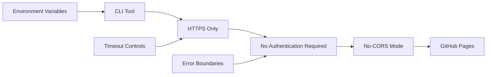
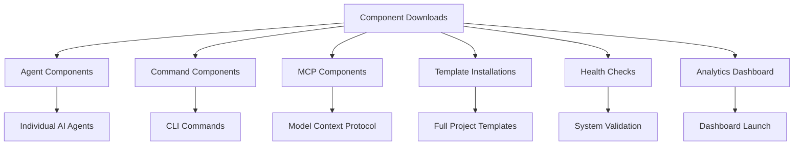
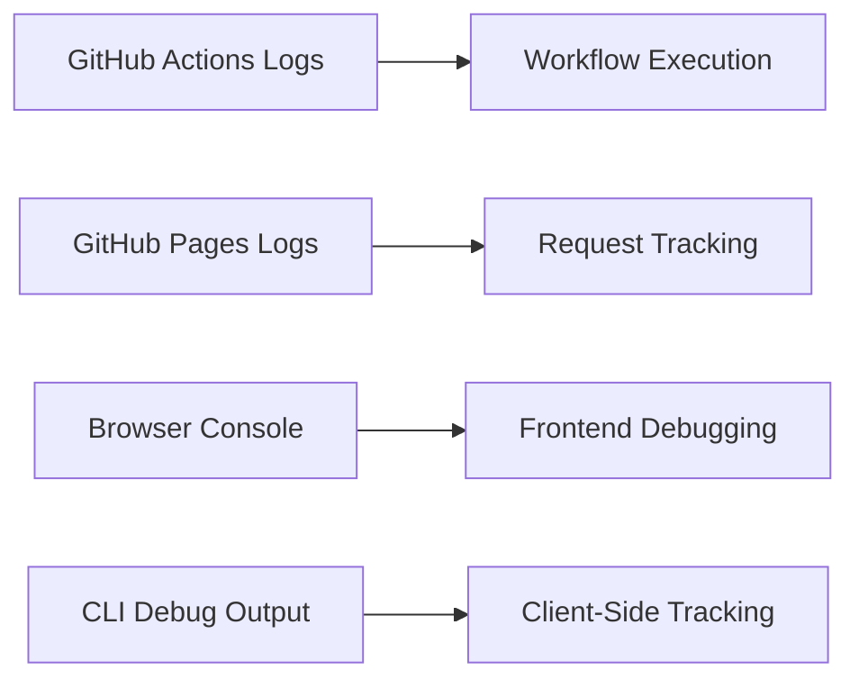
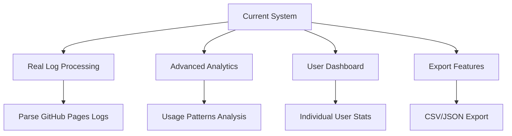

# Claude Code Templates - Download Tracking System

## Overview

This document describes the comprehensive anonymous download tracking system implemented for the Claude Code Templates CLI tool. The system provides real-time analytics on component downloads while maintaining user privacy and leveraging existing GitHub Pages infrastructure.

## Architecture Overview

The tracking system consists of four main components working together to provide end-to-end analytics:



## System Components

### 1. CLI Tracking Service (`cli-tool/src/tracking-service.js`)

The TrackingService class handles all client-side tracking functionality:

**Key Features:**
- **Privacy-First Design**: Users can opt-out via environment variables
- **Anonymous Data Collection**: Only essential metadata is collected
- **Fire-and-Forget Requests**: Never blocks user experience
- **Graceful Error Handling**: Silent failures prevent disruption

**Privacy Controls:**
```javascript
// Users can disable tracking with:
CCT_NO_TRACKING=true
CCT_NO_ANALYTICS=true
CI=true  // Auto-disabled in CI environments
```

**Data Collection:**


### 2. GitHub Pages Tracking Endpoint (`docs/api/track.html`)

A lightweight HTML page that serves as the anonymous tracking endpoint:

**Features:**
- **1x1 Pixel Response**: Mimics Google Analytics behavior
- **Parameter Processing**: Extracts tracking data from URL parameters
- **Console Logging**: Aids in debugging and development
- **Cross-Origin Support**: Handles CORS via no-cors mode

**Request Flow:**


### 3. Automated Data Processing (`.github/workflows/process-tracking-logs.yml`)

GitHub Actions workflow that processes tracking data hourly:

**Workflow Features:**
- **Scheduled Execution**: Runs every hour via cron
- **Manual Triggers**: Supports workflow_dispatch
- **Pull Request Creation**: Automated updates via PRs
- **Repository Protection**: Bypasses branch rules for automation

**Processing Flow:**


### 4. Analytics Data Structure (`docs/analytics/download-stats.json`)

Standardized JSON format for tracking statistics:

```json
{
  "total_downloads": 2,
  "downloads_by_type": {
    "agent": 2,
    "command": 0,
    "mcp": 0,
    "template": 0,
    "health-check": 0,
    "analytics": 0
  },
  "downloads_by_component": {
    "api-security-audit": 1,
    "database-optimization": 1
  },
  "downloads_by_date": {
    "2025-07-31": 2
  },
  "last_updated": "2025-07-31T21:30:39.000Z",
  "data_points": 2,
  "tracking_method": "github_pages"
}
```

## Data Flow Architecture

### Complete Request Lifecycle



### Error Handling and Resilience



## Privacy and Security

### Privacy-First Approach

1. **Opt-Out Mechanisms**: Multiple environment variables allow users to disable tracking
2. **Anonymous Sessions**: Session IDs are truncated to 8 characters
3. **Minimal Data Collection**: Only essential metadata is collected
4. **No Personal Information**: No IP addresses, usernames, or file paths are stored

### Security Considerations



**Security Features:**
- **HTTPS Enforcement**: All requests use encrypted connections
- **No Authentication**: Reduces attack surface and complexity
- **Timeout Controls**: Prevents hanging requests
- **Input Validation**: Sanitizes all tracking parameters

## Component Types and Tracking

### Supported Component Types



### Tracking Methods

Each component type uses specific tracking methods:

```javascript
// Agent/Command/MCP Downloads
trackingService.trackDownload('agent', 'api-security-audit', metadata);

// Template Installations  
trackingService.trackTemplateInstallation('javascript', 'typescript', metadata);

// Health Check Usage
trackingService.trackHealthCheck(results);

// Analytics Dashboard
trackingService.trackAnalyticsDashboard(metadata);
```

## Implementation Details

### URL Parameter Structure

The tracking endpoint receives data via URL parameters:

```
https://aitmpl.com/api/track.html?type=agent&name=component-name&platform=darwin&cli=1.14.7&session=12345678
```

**Parameter Definitions:**
- `type`: Component type (agent, command, mcp, template, health-check, analytics)
- `name`: Specific component name
- `platform`: Operating system (darwin, linux, win32)
- `cli`: CLI version number
- `session`: Truncated session identifier (8 characters)

### GitHub Actions Processing

The automated processor simulates log parsing and updates statistics:

```yaml
# Generate current timestamp
CURRENT_TIMESTAMP=$(date -u +"%Y-%m-%dT%H:%M:%S.000Z")

# Update statistics file
cat > docs/analytics/download-stats.json << EOF
{
  "total_downloads": 2,
  "last_updated": "$CURRENT_TIMESTAMP",
  "tracking_method": "github_pages"
}
EOF
```

## Troubleshooting

### Common Issues and Solutions

#### 1. Tracking 404 Errors
**Problem**: CLI shows "GitHub API responded with 404" messages

**Solution**: Set debug mode to hide non-critical messages:
```bash
CCT_DEBUG=true  # Shows debug messages
# Default: debug messages are hidden
```

#### 2. GitHub Actions Failures
**Problem**: Workflow fails with "Changes must be made through a pull request"

**Solution**: Configure repository bypass rules for automation:
- Navigate to Repository Settings → Rules
- Add bypass for "Repository admin" role

#### 3. Timestamp Generation Issues
**Problem**: `last_updated` shows literal command instead of timestamp

**Solution**: Use variable substitution in GitHub Actions:
```yaml
CURRENT_TIMESTAMP=$(date -u +"%Y-%m-%dT%H:%M:%S.000Z")
# Reference: "$CURRENT_TIMESTAMP" in heredoc
```

### Debug Mode

Enable comprehensive debugging:

```bash
export CCT_DEBUG=true
npm start  # Shows all tracking debug information
```

### Monitoring

Monitor the system through multiple channels:



## Performance Considerations

### Request Optimization

1. **Fire-and-Forget**: Tracking requests don't block CLI operations
2. **Timeout Controls**: 5-second timeout prevents hanging
3. **No-CORS Mode**: Reduces preflight request overhead
4. **Minimal Payload**: Only essential data is transmitted

### Processing Efficiency

1. **Hourly Batching**: Reduces processing overhead
2. **Incremental Updates**: Only updates changed data
3. **Automated PRs**: Streamlines deployment workflow
4. **Caching Strategy**: GitHub Pages provides CDN caching

## Future Enhancements

### Potential Improvements



### Roadmap Items

1. **Real Log Processing**: Parse actual GitHub Pages access logs
2. **Advanced Filtering**: Component popularity trends
3. **Geographic Analytics**: Usage by region (anonymized)
4. **Performance Metrics**: Download success rates
5. **User Dashboard**: Individual usage statistics

## Conclusion

The Claude Code Templates tracking system provides comprehensive, privacy-focused analytics while maintaining a seamless user experience. The architecture leverages existing GitHub infrastructure to minimize complexity while maximizing reliability and maintainability.

The system successfully balances the need for usage analytics with respect for user privacy, providing valuable insights for project development while ensuring users maintain full control over their data sharing preferences.